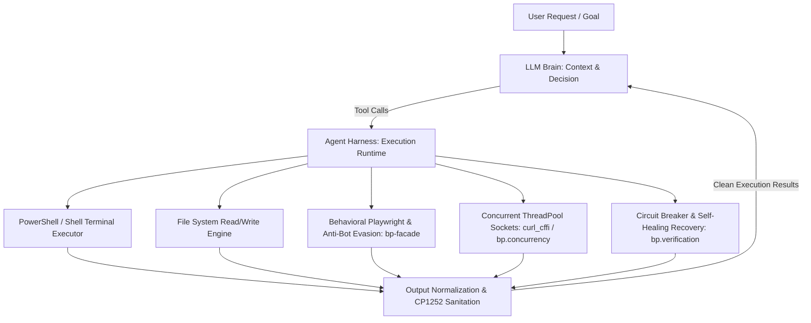

# Master Agent Harness Architecture

## 1. What is an Agent Harness? (The Execution Engine)

An LLM alone is just a pure text-generation model—it cannot run bash/powershell commands, open browsers, write to disk, or handle network timeouts.
The **Agent Harness** is the outer execution wrapper, scaffolding, and operational runtime that gives the AI physical capabilities, tools, and guardrails:

---

## 2. Core Responsibilities of the Agent Harness

### A. Autonomous Tool Dispatching
- The Harness intercepts the model's tool calls and executes them directly in the target environment (e.g. running scripts, searching directories, scraping endpoints) without demanding unnecessary human confirmations for routine actions.

### B. Environment Abstraction & OS Normalization
- Normalizes differences between operating systems (Windows PowerShell vs. Linux Bash).
- Enforces encoding safety (e.g. Windows `cp1252` vs UTF-8) to prevent terminal crashes.

### C. Concurrency & Network Orchestration
- Implements high-throughput worker pools (`ThreadPoolExecutor(max_workers=8)`) for sub-second data extraction.
- Manages HTTP/TLS session pooling, JA3/JA4 fingerprint impersonation, and socket timeouts.

### D. Self-Healing Error Interception
- When an execution fails (e.g. anti-bot block, selector mutation, network timeout), the Harness captures the exact error trace and feeds it back to the agent's context so the agent dynamically self-corrects without crashing.

---

## 3. How Harness Cooperates with Context Engineering & FastAPI

| Component | Role | Metaphor |
| :--- | :--- | :--- |
| **FastAPI** | Network Gateway & Schema Validator | **The Front Counter** (Receives orders and returns packages) |
| **Context Engineering** | Rules, Prompts, Token Pruning & Working Memory on Disk | **The Master Chef's Recipe** (The intelligence and constraints) |
| **Agent Harness** | Runtime Scaffolding, Tool Dispatcher, Process Manager | **The Kitchen & Delivery Fleet** (The muscle that cooks and delivers) |

---

## 4. Harness Operational Rules

1. **Proactive Non-Blocking Execution:** Always execute necessary validation and extraction tasks directly.
2. **Sub-2-Second Law:** Harness must leverage asynchronous sockets and worker pools rather than heavy sequential loops.
3. **Fail-Fast & Pivot:** When an endpoint or tool is throttled (e.g. ISP blocks or rate limits), the Harness immediately routes traffic through alternative providers or edge caches.
