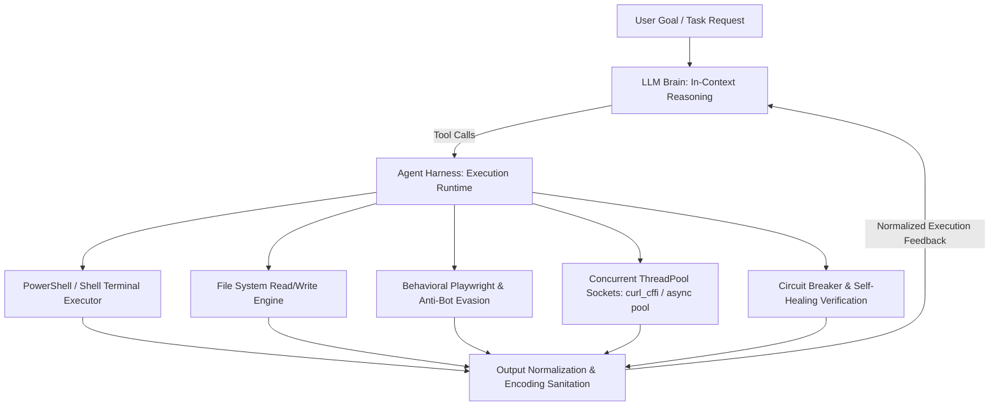

# Master Agent Harness 🛠️

## 1. What is an Agent Harness?
An LLM alone is just a pure probabilistic token generator—it cannot independently run bash/powershell commands, navigate web browsers, write to disk, or intercept network dropouts.
The **Agent Harness** is the outer execution wrapper, scaffolding, and operational runtime that gives the AI physical capabilities, tools, guardrails, and environment sandboxing.

## 2. Core Responsibilities
- **Autonomous Tool Dispatching:** Intercepts model tool calls and runs them safely in the target environment.
- **Environment Abstraction:** Normalizes OS differences (Windows PowerShell vs. Linux Bash), UTF-8 vs CP1252 character encoding.
- **Self-Healing Error Interception:** Automatically captures exception stack traces and feeds them back to context for self-correction.
- **Quality Gate Verification:** Enforces terminal test runs with Exit Code 0 before declaring work complete.

## 3. The Zero-Fraud Engineering Codex
Refer to [ZERO_FRAUD_CODEX.md](./ZERO_FRAUD_CODEX.md) for the 26 Invariant Laws, trust boundary hierarchies, cryptographic provenance chains, and anti-fraud verification principles governing all agent executions.
